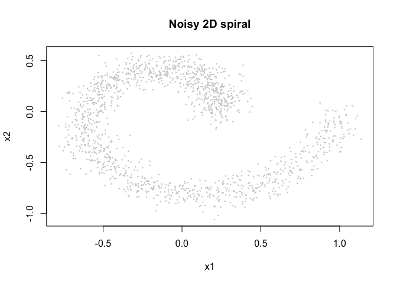
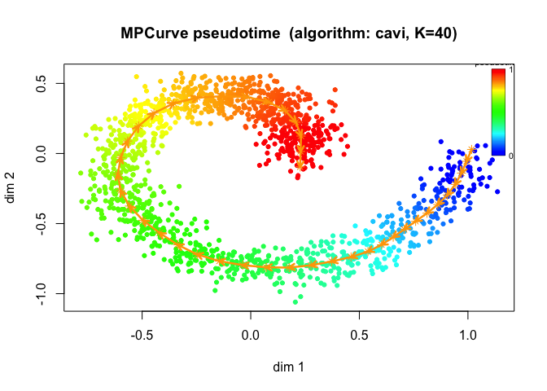
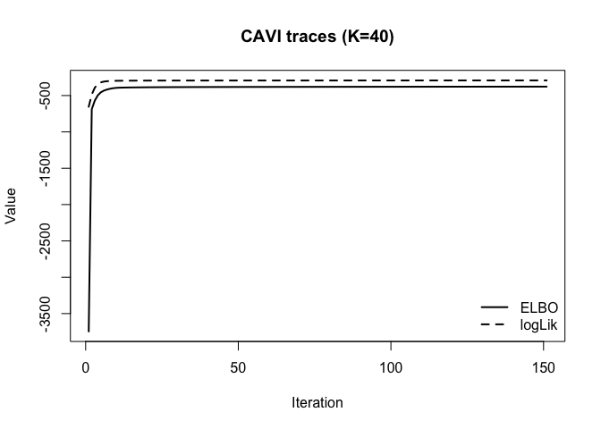

<!-- README.md is generated from README.Rmd. Please edit that file -->

# MPCurver

<!-- badges: start -->

<!-- badges: end -->

`MPCurver` fits smooth latent orderings with Gaussian-mixture / GMRF
models.

The recommended workflow uses the **`cavi` variational backend** through
`fit_mpcurve()`. The older `csmooth_em` and `smooth_em` algorithms are
kept only as lower-level compatibility helpers and are no longer part of
the main package workflow.

## Documentation

The package documentation is organized around the recommended `cavi`
workflow, with legacy material intentionally pushed out of the main
entry points.

- `vignettes/mpcurve_intro.Rmd`: current single-ordering introduction.
- `vignettes/partition.Rmd`: current dual-ordering / feature-partition
  tools.
- `important_derivations/cavi_math_details.Rmd`: repo-level derivation
  of the single-ordering CAVI updates.
- `important_derivations/cavi_vs_csmooth_math.Rmd`: repo-level
  comparison between `cavi` and legacy `csmooth_em`.

## Installation

You can install the development version of `MPCurver` like so:

``` r
pak::pak("AgueroZZ/MPCurver")
```

## Example

This is a basic example using the recommended `mpcurve` interface:

``` r
library(MPCurver)
```

We will simulate a moderately easy 2D spiral and fit the default
MPCurver workflow.

``` r
sim <- simulate_spiral2d(n = 1500, turns = 1, noise = 0.08, seed = 123)
plot(sim$obs, pch = 16, cex = 0.35, col = "grey80",
     xlab = "x1", ylab = "x2", main = "Noisy 2D spiral")
```



Now we fit the model with `fit_mpcurve()`. The public wrapper is
CAVI-first, so there is no longer an `algorithm` switch here.

``` r
set.seed(123)
fit <- fit_mpcurve(
  X = as.matrix(sim$obs),
  method = "isomap",
  K = 40,
  rw_q = 2,
  iter = 150,
  discretization = "equal",
  tol = 1e-8
)

plot(fit)
```



``` r
plot(fit, plot_type = "elbo")
```



We can compare several initialization strategies under the same `cavi`
model:

``` r
fits <- fit_mpcurve(
  X = as.matrix(sim$obs),
  method = c("PCA", "fiedler", "isomap"),
  K = 40,
  rw_q = 2,
  iter = 150,
  discretization = "equal",
  tol = 1e-8,
  num_cores = 1
)

attr(fits, "summary")
#> NULL
```

`fit_mpcurve()` returns either a single `mpcurve` fit or a list of fits.
Each fit keeps the unified `params`, `gamma`, `elbo_trace`,
`loglik_trace`, and the underlying raw fit in `$fit`.

Legacy `csmooth_em` and `smooth_em` code paths are still present as
lower-level compatibility functions, but they are no longer part of the
public `fit_mpcurve()` wrapper.

For dual-ordering analyses, the recommended public entry point is
`fit_mpcurve(..., intrinsic_dim = 2)` or more generally
`fit_mpcurve(..., intrinsic_dim = M)`. The lower-level
`soft_two_trajectory_cavi()` helper is still available for explicit
two-fit initialization workflows.
