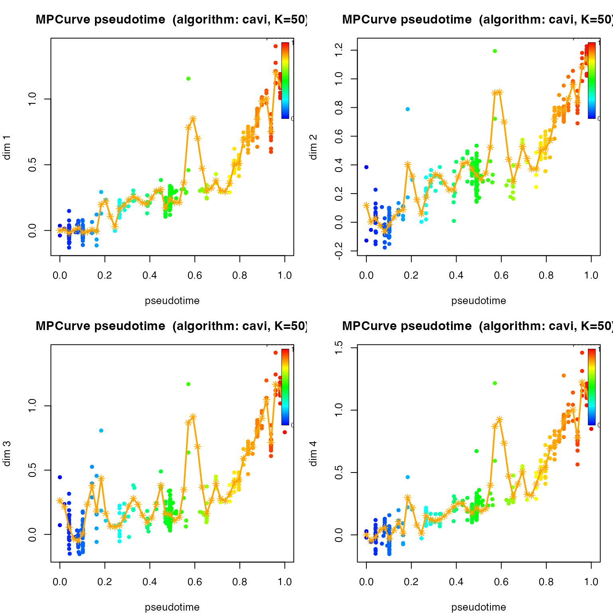
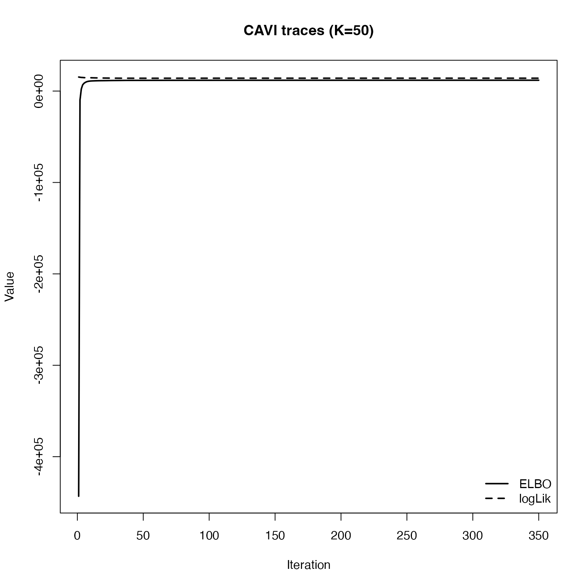
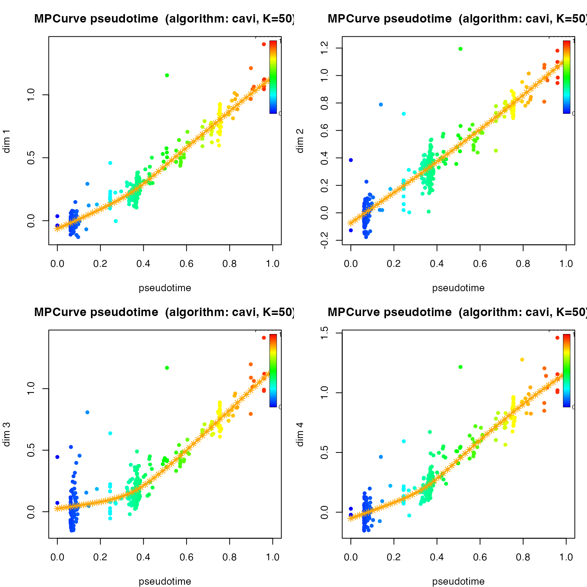

# Analysis on the eLife Fitness Dataset using MPCurver

## Overview

This note revisits the eLife fitness dataset using the current unified
interface in `MPCurver`, with a specific focus on **learning the number
of latent ordering systems**.

We now keep the workflow intentionally simple:

- use `isomap` as the initialization method;
- set `K = 50`;

## First look at the data:

Take a look at the number of mutants and environments.

``` r
data.frame(
    quantity = c("mutants", "environments", "fitness columns", "error columns"),
    value = c(nrow(X), ncol(X), length(fitness_cols), length(error_cols))
) |>
    knitr::kable()
```

| quantity        | value |
|:----------------|------:|
| mutants         |   421 |
| environments    |    45 |
| fitness columns |    45 |
| error columns   |    45 |

``` r
sort(table(env_category), decreasing = TRUE) |>
    as.data.frame() |>
    stats::setNames(c("category", "n_environments")) |>
    knitr::kable()
```

| category        | n_environments |
|:----------------|---------------:|
| time course     |             10 |
| glucose / batch |              9 |
| other           |              9 |
| drug / chemical |              8 |
| carbon source   |              5 |
| salt stress     |              4 |

## Initial fit of a MPCurver

First, we will try to fit a MPCurve using `MPCurver` package, the goal
is to learn the latent position of all the mutants such that their
fitness scores are functions that vary smoothly along the latent
positions.

``` r
fit_unidir <- fit_mpcurve(
    X,
    method = "isomap",
    K = 50,
    rw_q = 2,
    verbose = FALSE
)
```

Take a look at the convergence:

``` r
plot(fit_unidir, plot_type = "elbo")
```


Look at some fitted trajectories (first 4 environments):

``` r
par(mfrow = c(2, 2), mar = c(4, 4, 3, 1))
plot(fit_unidir, dims = 1)
plot(fit_unidir, dims = 2)
plot(fit_unidir, dims = 3)
plot(fit_unidir, dims = 4)
```



``` r
par(mfrow = c(1, 1))
```

These four environments (EC Batch 19, EC Batch 3, EC Batch 6, EC Batch
13) show very similar trajectories along the latent position, both
appearing to increase with latent positions. However, the fitted curves
appear to be quite wiggly. To make the curves smoother, we can apply a
prior on $`\lambda`$, which controls the roughness of the trajectories.
The prior is an exponential prior assigned to $`1/sqrt(\lambda)`$. By
increasing the rate parameter of the exponential prior, we can make the
fitted trajectories smoother.

``` r
fit_unidir_smooth <- fit_mpcurve(
    X,
    method = "isomap",
    K = 50,
    iter = 500,
    rw_q = 2,
    lambda_sd_prior_rate = 1e4,
    verbose = FALSE
)
```

Again, check if the model has converged:

``` r
plot(fit_unidir_smooth, plot_type = "elbo")
```



``` r
summary(fit_unidir_smooth)
```

    ## MPCurve Model Summary
    ## Algorithm : cavi  |  Model : homoskedastic  |  n=421  d=45  K=50
    ## Underlying fit summary
    ## <summary.cavi>
    ##   n = 421, d = 45, K = 50
    ##   model = homoskedastic, RW(q) = 2
    ##   init = isomap, discretization = quantile, adaptive = variational
    ##   iter = 349, converged = yes
    ##   last ELBO = 11842.508 (delta last = 0.01137)
    ##   last logLik = 14069.441 (delta last = 0.01416)
    ##   pi range = [2.22e-16, 0.369]
    ##   sigma2 range = [0.001992, 0.3605]
    ##   lambda range = [22147, 4771014]
    ##   relative change (last step):
    ##     ELBO: 9.6e-07
    ##     logLik: 1.01e-06
    ##     lambda_vec (L2 rel): 0.00428

Take a look at the fitted trajectories:

``` r
par(mfrow = c(2, 2), mar = c(4, 4, 3, 1))
plot(fit_unidir_smooth, dims = 1)
plot(fit_unidir_smooth, dims = 2)
plot(fit_unidir_smooth, dims = 3)
plot(fit_unidir_smooth, dims = 4)
```



``` r
par(mfrow = c(1, 1))
```

This looks much more reaonsable to me. We can compare the mean latent
positions learned by the two models:

``` r
cor(fit_unidir_smooth$locations$mean$pseudotime, fit_unidir$locations$mean$pseudotime)
```

    ## [1] 0.952165

``` r
plot(fit_unidir_smooth$locations$mean$pseudotime, fit_unidir$locations$mean$pseudotime,
    xlab = "Latent position (smooth)", ylab = "Latent position (rough)"
)
abline(0, 1, lty = 2)
```


The latent positions do not change much, but the trajectories are much
smoother.
